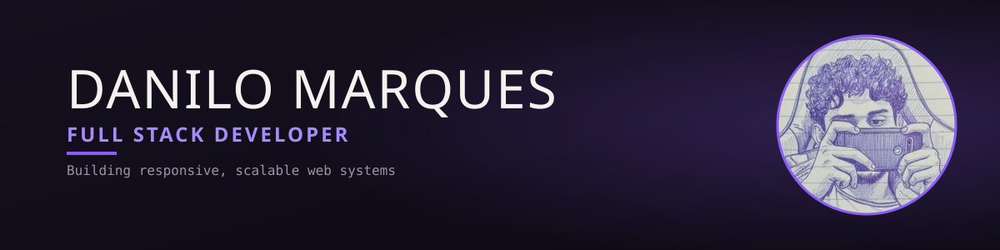

CS student at FATEC Praia Grande, building full stack web systems from interface to database. Open to remote internships.

### 🔭 Currently
- Working on: Sistema Formiguinhas (gestão para ONG)
- Learning: shadcn/ui

---
📫 Como me encontrar: [LinkedIn](...) · [Email](...) · [Portfólio](...)
